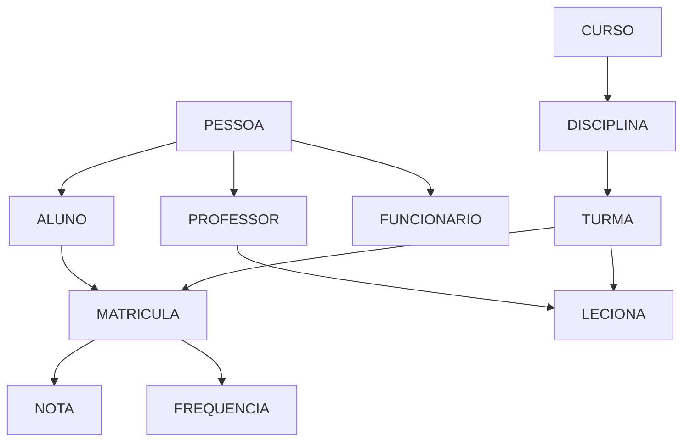

# 🗄️ Guia Prático: Modelagem de Dados e Formas Normais

## 📚 Índice

1. [Projeto Prático: Sistema de Gestão Acadêmica](#projeto-prático-sistema-de-gestão-acadêmica)
2. [Fase 1: Análise de Requisitos](#fase-1-análise-de-requisitos)
3. [Fase 2: Modelagem Conceitual (ER)](#fase-2-modelagem-conceitual-er)
4. [Fase 3: Modelagem Lógica](#fase-3-modelagem-lógica)
5. [Fase 4: Normalização](#fase-4-normalização)
6. [Fase 5: Modelagem Física](#fase-5-modelagem-física)
7. [Fase 6: Modelagem Dimensional](#fase-6-modelagem-dimensional)
8. [Fase 7: Implementação NoSQL](#fase-7-implementação-nosql)
9. [Fase 8: Otimização e Performance](#fase-8-otimização-e-performance)
10. [Ferramentas e Boas Práticas](#ferramentas-e-boas-práticas)

---

## 🎯 Projeto Prático: Sistema de Gestão Acadêmica

### Visão Geral

Vamos desenvolver um sistema completo de gestão acadêmica que abrange desde a modelagem conceitual até implementações em diferentes paradigmas de banco de dados.

### Objetivos de Aprendizado

- ✅ Aplicar técnicas de modelagem ER
- ✅ Dominar o processo de normalização
- ✅ Implementar modelagem dimensional
- ✅ Explorar alternativas NoSQL
- ✅ Otimizar performance
- ✅ Aplicar boas práticas

---

## 📋 Fase 1: Análise de Requisitos

### 1.1 Levantamento de Requisitos

**Requisitos Funcionais:**

1. **Gestão de Pessoas:**
   - Cadastro de alunos, professores e funcionários
   - Controle de dados pessoais e acadêmicos
   - Histórico de mudanças

2. **Gestão Acadêmica:**
   - Cursos, disciplinas e turmas
   - Matrículas e pré-requisitos
   - Notas e frequência
   - Histórico escolar

3. **Gestão Administrativa:**
   - Calendário acadêmico
   - Salas e recursos
   - Horários de aula
   - Financeiro (mensalidades, bolsas)

4. **Relatórios e Analytics:**
   - Desempenho acadêmico
   - Indicadores institucionais
   - Relatórios regulatórios

**Requisitos Não-Funcionais:**
- Performance: Consultas < 2 segundos
- Escalabilidade: 50.000 alunos
- Disponibilidade: 99.9%
- Segurança: LGPD compliance

### 1.2 Identificação de Entidades Principais



### 1.3 Casos de Uso Principais

```python
# Casos de uso identificados
casos_uso = {
    "aluno": [
        "matricular_disciplina",
        "consultar_notas",
        "gerar_historico",
        "avaliar_professor"
    ],
    "professor": [
        "lancar_notas",
        "registrar_frequencia",
        "gerar_relatorio_turma",
        "planejar_aulas"
    ],
    "coordenador": [
        "aprovar_matriculas",
        "alocar_professores",
        "gerar_horarios",
        "analisar_desempenho"
    ],
    "secretaria": [
        "cadastrar_alunos",
        "emitir_documentos",
        "controlar_financeiro",
        "gerar_relatorios"
    ]
}
```

---

## 🎨 Fase 2: Modelagem Conceitual (ER)

### 2.1 Diagrama ER Inicial

```sql
-- Entidades Identificadas:
-- PESSOA (superclasse)
-- ALUNO, PROFESSOR, FUNCIONARIO (subclasses)
-- CURSO, DISCIPLINA, TURMA
-- MATRICULA, NOTA, FREQUENCIA
-- SALA, PERIODO, CALENDARIO
```

### 2.2 Definição de Entidades e Atributos

**PESSOA (Superclasse)**
```sql
PESSOA {
    id_pessoa: INT [PK]
    cpf: VARCHAR(11) [UNIQUE]
    nome: VARCHAR(100)
    data_nascimento: DATE
    genero: ENUM('M', 'F', 'O')
    telefone: VARCHAR(15)
    email: VARCHAR(100)
    endereco: TEXT
    data_cadastro: TIMESTAMP
    ativo: BOOLEAN
}
```

**ALUNO (Subclasse)**
```sql
ALUNO {
    id_pessoa: INT [PK, FK]
    matricula: VARCHAR(20) [UNIQUE]
    data_ingresso: DATE
    situacao: ENUM('ATIVO', 'TRANCADO', 'FORMADO', 'DESISTENTE')
    id_curso: INT [FK]
    periodo_atual: INT
    cr: DECIMAL(4,2)  -- Coeficiente de Rendimento
}
```

**PROFESSOR (Subclasse)**
```sql
PROFESSOR {
    id_pessoa: INT [PK, FK]
    siape: VARCHAR(20) [UNIQUE]
    titulacao: ENUM('GRADUACAO', 'ESPECIALIZACAO', 'MESTRADO', 'DOUTORADO')
    regime: ENUM('20H', '40H', 'DE')  -- Dedicação Exclusiva
    data_admissao: DATE
    salario: DECIMAL(10,2)
    id_departamento: INT [FK]
}
```

**CURSO**
```sql
CURSO {
    id_curso: INT [PK]
    nome: VARCHAR(100)
    codigo: VARCHAR(10) [UNIQUE]
    tipo: ENUM('BACHARELADO', 'LICENCIATURA', 'TECNOLOGO')
    duracao_semestres: INT
    carga_horaria_total: INT
    id_coordenador: INT [FK] -- Professor
    ativo: BOOLEAN
}
```

**DISCIPLINA**
```sql
DISCIPLINA {
    id_disciplina: INT [PK]
    codigo: VARCHAR(10) [UNIQUE]
    nome: VARCHAR(100)
    carga_horaria: INT
    creditos: INT
    ementa: TEXT
    bibliografia: TEXT
    id_departamento: INT [FK]
    ativa: BOOLEAN
}
```

### 2.3 Relacionamentos

**MATRICULA (N:M entre ALUNO e TURMA)**
```sql
MATRICULA {
    id_matricula: INT [PK]
    id_aluno: INT [FK]
    id_turma: INT [FK]
    data_matricula: DATE
    situacao: ENUM('MATRICULADO', 'APROVADO', 'REPROVADO', 'TRANCADO')
    nota_final: DECIMAL(4,2)
    frequencia_final: DECIMAL(5,2)
    faltas: INT
}
```

**PRE_REQUISITO (N:M entre DISCIPLINA)**
```sql
PRE_REQUISITO {
    id_disciplina: INT [FK]      -- Disciplina que tem pré-requisito
    id_pre_requisito: INT [FK]   -- Disciplina que é pré-requisito
    tipo: ENUM('OBRIGATORIO', 'RECOMENDADO')
}
```

### 2.4 Cardinalidades

```python
# Definição de cardinalidades
cardinalidades = {
    "PESSOA -> ALUNO": "1:1",
    "PESSOA -> PROFESSOR": "1:1", 
    "CURSO -> ALUNO": "1:N",
    "PROFESSOR -> TURMA": "1:N",
    "DISCIPLINA -> TURMA": "1:N",
    "ALUNO -> MATRICULA": "1:N",
    "TURMA -> MATRICULA": "1:N",
    "DISCIPLINA -> PRE_REQUISITO": "N:M"
}
```

---

## 🔧 Fase 3: Modelagem Lógica

### 3.1 Conversão ER para Modelo Relacional

**Estratégia para Herança:**
Usaremos a abordagem "Table per Subclass" para manter a integridade e flexibilidade.

```sql
-- Tabela principal
CREATE TABLE PESSOA (
    id_pessoa INT AUTO_INCREMENT PRIMARY KEY,
    cpf VARCHAR(11) UNIQUE NOT NULL,
    nome VARCHAR(100) NOT NULL,
    data_nascimento DATE,
    genero ENUM('M', 'F', 'O'),
    telefone VARCHAR(15),
    email VARCHAR(100),
    endereco TEXT,
    data_cadastro TIMESTAMP DEFAULT CURRENT_TIMESTAMP,
    ativo BOOLEAN DEFAULT TRUE,
    
    -- Índices
    INDEX idx_cpf (cpf),
    INDEX idx_nome (nome),
    INDEX idx_email (email)
);

-- Subclasse ALUNO
CREATE TABLE ALUNO (
    id_pessoa INT PRIMARY KEY,
    matricula VARCHAR(20) UNIQUE NOT NULL,
    data_ingresso DATE NOT NULL,
    situacao ENUM('ATIVO', 'TRANCADO', 'FORMADO', 'DESISTENTE') DEFAULT 'ATIVO',
    id_curso INT NOT NULL,
    periodo_atual INT DEFAULT 1,
    cr DECIMAL(4,2) DEFAULT 0.00,
    
    FOREIGN KEY (id_pessoa) REFERENCES PESSOA(id_pessoa) ON DELETE CASCADE,
    FOREIGN KEY (id_curso) REFERENCES CURSO(id_curso),
    
    INDEX idx_matricula (matricula),
    INDEX idx_situacao (situacao),
    INDEX idx_curso (id_curso)
);

-- Subclasse PROFESSOR
CREATE TABLE PROFESSOR (
    id_pessoa INT PRIMARY KEY,
    siape VARCHAR(20) UNIQUE NOT NULL,
    titulacao ENUM('GRADUACAO', 'ESPECIALIZACAO', 'MESTRADO', 'DOUTORADO'),
    regime ENUM('20H', '40H', 'DE') DEFAULT '40H',
    data_admissao DATE,
    salario DECIMAL(10,2),
    id_departamento INT,
    
    FOREIGN KEY (id_pessoa) REFERENCES PESSOA(id_pessoa) ON DELETE CASCADE,
    FOREIGN KEY (id_departamento) REFERENCES DEPARTAMENTO(id_departamento),
    
    INDEX idx_siape (siape),
    INDEX idx_departamento (id_departamento)
);
```

### 3.2 Tabelas de Relacionamento

```sql
-- Tabela TURMA
CREATE TABLE TURMA (
    id_turma INT AUTO_INCREMENT PRIMARY KEY,
    id_disciplina INT NOT NULL,
    id_professor INT NOT NULL,
    codigo_turma VARCHAR(10) NOT NULL,
    semestre VARCHAR(6) NOT NULL, -- Ex: 2024.1
    vagas INT DEFAULT 40,
    vagas_ocupadas INT DEFAULT 0,
    horario JSON, -- Armazena horários em formato JSON
    id_sala INT,
    
    FOREIGN KEY (id_disciplina) REFERENCES DISCIPLINA(id_disciplina),
    FOREIGN KEY (id_professor) REFERENCES PROFESSOR(id_pessoa),
    FOREIGN KEY (id_sala) REFERENCES SALA(id_sala),
    
    UNIQUE KEY uk_turma (id_disciplina, codigo_turma, semestre),
    INDEX idx_semestre (semestre),
    INDEX idx_professor (id_professor)
);

-- Tabela MATRICULA
CREATE TABLE MATRICULA (
    id_matricula INT AUTO_INCREMENT PRIMARY KEY,
    id_aluno INT NOT NULL,
    id_turma INT NOT NULL,
    data_matricula DATE DEFAULT (CURRENT_DATE),
    situacao ENUM('MATRICULADO', 'APROVADO', 'REPROVADO', 'TRANCADO') DEFAULT 'MATRICULADO',
    nota_final DECIMAL(4,2),
    frequencia_final DECIMAL(5,2),
    faltas INT DEFAULT 0,
    
    FOREIGN KEY (id_aluno) REFERENCES ALUNO(id_pessoa),
    FOREIGN KEY (id_turma) REFERENCES TURMA(id_turma),
    
    UNIQUE KEY uk_matricula (id_aluno, id_turma),
    INDEX idx_situacao (situacao),
    INDEX idx_semestre_aluno (id_aluno, data_matricula)
);
```

### 3.3 Tabelas de Apoio

```sql
-- Tabela AVALIACAO (para controle de notas parciais)
CREATE TABLE AVALIACAO (
    id_avaliacao INT AUTO_INCREMENT PRIMARY KEY,
    id_matricula INT NOT NULL,
    tipo ENUM('PROVA', 'TRABALHO', 'SEMINARIO', 'PROJETO') NOT NULL,
    descricao VARCHAR(100),
    nota DECIMAL(4,2) NOT NULL,
    peso DECIMAL(3,2) DEFAULT 1.00,
    data_avaliacao DATE,
    
    FOREIGN KEY (id_matricula) REFERENCES MATRICULA(id_matricula) ON DELETE CASCADE,
    
    INDEX idx_matricula (id_matricula),
    INDEX idx_tipo (tipo)
);

-- Tabela FREQUENCIA (para controle detalhado)
CREATE TABLE FREQUENCIA (
    id_frequencia INT AUTO_INCREMENT PRIMARY KEY,
    id_matricula INT NOT NULL,
    data_aula DATE NOT NULL,
    presente BOOLEAN DEFAULT FALSE,
    justificativa TEXT,
    
    FOREIGN KEY (id_matricula) REFERENCES MATRICULA(id_matricula) ON DELETE CASCADE,
    
    UNIQUE KEY uk_frequencia (id_matricula, data_aula),
    INDEX idx_data (data_aula)
);
```

---

## 📐 Fase 4: Normalização

### 4.1 Análise da Primeira Forma Normal (1FN)

**Problema Identificado:**
A tabela TURMA tem o campo `horario` como JSON, violando 1FN.

**Solução:**
```sql
-- Criar tabela separada para horários
CREATE TABLE HORARIO_TURMA (
    id_horario INT AUTO_INCREMENT PRIMARY KEY,
    id_turma INT NOT NULL,
    dia_semana ENUM('SEG', 'TER', 'QUA', 'QUI', 'SEX', 'SAB') NOT NULL,
    hora_inicio TIME NOT NULL,
    hora_fim TIME NOT NULL,
    
    FOREIGN KEY (id_turma) REFERENCES TURMA(id_turma) ON DELETE CASCADE,
    
    INDEX idx_turma (id_turma),
    INDEX idx_dia (dia_semana)
);

-- Remover campo horario da tabela TURMA
ALTER TABLE TURMA DROP COLUMN horario;
```

### 4.2 Análise da Segunda Forma Normal (2FN)

**Dependências Funcionais Identificadas:**

```python
# Análise de dependências funcionais
dependencias = {
    "MATRICULA": {
        "id_matricula -> id_aluno, id_turma, data_matricula": "OK",
        "id_aluno, id_turma -> nota_final, frequencia_final": "OK"
    },
    "AVALIACAO": {
        "id_avaliacao -> id_matricula, tipo, nota": "OK",
        "id_matricula, tipo -> nota": "Dependência parcial detectada"
    }
}
```

**Problema:** Na tabela AVALIACAO, se permitirmos múltiplas avaliações do mesmo tipo por matrícula, temos dependência parcial.

**Solução:**
```sql
-- Adicionar campo sequencial para distinguir avaliações do mesmo tipo
ALTER TABLE AVALIACAO ADD COLUMN sequencia INT DEFAULT 1;

-- Criar chave composta
ALTER TABLE AVALIACAO ADD UNIQUE KEY uk_avaliacao (id_matricula, tipo, sequencia);
```

### 4.3 Análise da Terceira Forma Normal (3FN)

**Dependência Transitiva Identificada:**
Na tabela ALUNO: `id_aluno -> id_curso -> nome_curso`

**Verificação:**
```sql
-- A tabela CURSO já existe separadamente, então está OK
-- Verificar se não há outros campos derivados

-- Problema: CR (Coeficiente de Rendimento) pode ser calculado
-- Decisão: Manter como campo calculado para performance
-- Implementar trigger para atualização automática

DELIMITER //
CREATE TRIGGER tr_atualizar_cr
AFTER UPDATE ON MATRICULA
FOR EACH ROW
BEGIN
    IF NEW.situacao IN ('APROVADO', 'REPROVADO') THEN
        UPDATE ALUNO SET cr = (
            SELECT 
                SUM(CASE 
                    WHEN m.situacao = 'APROVADO' THEN d.creditos * m.nota_final 
                    ELSE 0 
                END) / 
                SUM(CASE 
                    WHEN m.situacao IN ('APROVADO', 'REPROVADO') THEN d.creditos 
                    ELSE 0 
                END)
            FROM MATRICULA m
            JOIN TURMA t ON m.id_turma = t.id_turma
            JOIN DISCIPLINA d ON t.id_disciplina = d.id_disciplina
            WHERE m.id_aluno = NEW.id_aluno
              AND m.situacao IN ('APROVADO', 'REPROVADO')
        )
        WHERE id_pessoa = NEW.id_aluno;
    END IF;
END //
DELIMITER ;
```

### 4.4 Análise da Forma Normal de Boyce-Codd (BCNF)

**Verificação de Dependências Funcionais:**

```sql
-- Todas as dependências funcionais têm determinantes que são superchaves
-- Modelo está em BCNF

-- Exemplo de verificação na tabela MATRICULA:
-- Dependências: {id_matricula} -> {todos os outros atributos}
-- Determinante id_matricula é chave primária (superchave) ✓

-- Dependência: {id_aluno, id_turma} -> {todos os outros atributos}
-- Determinante {id_aluno, id_turma} é chave candidata (superchave) ✓
```

### 4.5 Desnormalização Estratégica

**Casos onde a desnormalização pode ser benéfica:**

```sql
-- 1. Tabela de cache para consultas frequentes
CREATE TABLE CACHE_HISTORICO_ALUNO (
    id_aluno INT PRIMARY KEY,
    total_creditos INT,
    creditos_aprovados INT,
    cr_atual DECIMAL(4,2),
    percentual_conclusao DECIMAL(5,2),
    ultima_atualizacao TIMESTAMP DEFAULT CURRENT_TIMESTAMP ON UPDATE CURRENT_TIMESTAMP,
    
    FOREIGN KEY (id_aluno) REFERENCES ALUNO(id_pessoa)
);

-- 2. Tabela desnormalizada para relatórios
CREATE TABLE RELATORIO_DESEMPENHO (
    id INT AUTO_INCREMENT PRIMARY KEY,
    semestre VARCHAR(6),
    id_curso INT,
    nome_curso VARCHAR(100),
    total_alunos INT,
    aprovados INT,
    reprovados INT,
    trancamentos INT,
    taxa_aprovacao DECIMAL(5,2),
    cr_medio DECIMAL(4,2),
    data_calculo TIMESTAMP DEFAULT CURRENT_TIMESTAMP,
    
    INDEX idx_semestre_curso (semestre, id_curso)
);
```

---

## 🏗️ Fase 5: Modelagem Física

### 5.1 Otimização de Índices

```sql
-- Índices para consultas frequentes

-- 1. Consulta de notas por aluno
CREATE INDEX idx_matricula_aluno_semestre 
ON MATRICULA (id_aluno, data_matricula DESC);

-- 2. Consulta de turmas por professor
CREATE INDEX idx_turma_professor_semestre 
ON TURMA (id_professor, semestre);

-- 3. Consulta de horários
CREATE INDEX idx_horario_dia_hora 
ON HORARIO_TURMA (dia_semana, hora_inicio);

-- 4. Índice composto para relatórios
CREATE INDEX idx_relatorio_performance 
ON MATRICULA (situacao, data_matricula, nota_final);

-- 5. Índice para busca textual
CREATE FULLTEXT INDEX idx_pessoa_nome_fulltext 
ON PESSOA (nome);
```

### 5.2 Particionamento

```sql
-- Particionamento da tabela MATRICULA por ano
ALTER TABLE MATRICULA 
PARTITION BY RANGE (YEAR(data_matricula)) (
    PARTITION p2020 VALUES LESS THAN (2021),
    PARTITION p2021 VALUES LESS THAN (2022),
    PARTITION p2022 VALUES LESS THAN (2023),
    PARTITION p2023 VALUES LESS THAN (2024),
    PARTITION p2024 VALUES LESS THAN (2025),
    PARTITION p_future VALUES LESS THAN MAXVALUE
);

-- Particionamento da tabela FREQUENCIA por mês
ALTER TABLE FREQUENCIA 
PARTITION BY RANGE (TO_DAYS(data_aula)) (
    PARTITION p202401 VALUES LESS THAN (TO_DAYS('2024-02-01')),
    PARTITION p202402 VALUES LESS THAN (TO_DAYS('2024-03-01')),
    -- ... continuar para outros meses
    PARTITION p_future VALUES LESS THAN MAXVALUE
);
```

### 5.3 Stored Procedures e Functions

```sql
-- Procedure para matrícula de aluno
DELIMITER //
CREATE PROCEDURE sp_matricular_aluno(
    IN p_id_aluno INT,
    IN p_id_turma INT,
    OUT p_resultado VARCHAR(100)
)
BEGIN
    DECLARE v_vagas_disponiveis INT;
    DECLARE v_tem_prerequisito BOOLEAN DEFAULT TRUE;
    DECLARE v_conflito_horario BOOLEAN DEFAULT FALSE;
    
    DECLARE EXIT HANDLER FOR SQLEXCEPTION
    BEGIN
        ROLLBACK;
        SET p_resultado = 'Erro na matrícula';
    END;
    
    START TRANSACTION;
    
    -- Verificar vagas disponíveis
    SELECT (vagas - vagas_ocupadas) INTO v_vagas_disponiveis
    FROM TURMA WHERE id_turma = p_id_turma;
    
    IF v_vagas_disponiveis <= 0 THEN
        SET p_resultado = 'Turma lotada';
        ROLLBACK;
    ELSE
        -- Verificar pré-requisitos
        CALL sp_verificar_prerequisitos(p_id_aluno, p_id_turma, v_tem_prerequisito);
        
        IF NOT v_tem_prerequisito THEN
            SET p_resultado = 'Pré-requisitos não atendidos';
            ROLLBACK;
        ELSE
            -- Verificar conflito de horário
            CALL sp_verificar_conflito_horario(p_id_aluno, p_id_turma, v_conflito_horario);
            
            IF v_conflito_horario THEN
                SET p_resultado = 'Conflito de horário';
                ROLLBACK;
            ELSE
                -- Realizar matrícula
                INSERT INTO MATRICULA (id_aluno, id_turma) 
                VALUES (p_id_aluno, p_id_turma);
                
                -- Atualizar vagas ocupadas
                UPDATE TURMA SET vagas_ocupadas = vagas_ocupadas + 1 
                WHERE id_turma = p_id_turma;
                
                SET p_resultado = 'Matrícula realizada com sucesso';
                COMMIT;
            END IF;
        END IF;
    END IF;
END //
DELIMITER ;

-- Function para calcular CR
DELIMITER //
CREATE FUNCTION fn_calcular_cr(p_id_aluno INT) 
RETURNS DECIMAL(4,2)
READS SQL DATA
DETERMINISTIC
BEGIN
    DECLARE v_cr DECIMAL(4,2) DEFAULT 0.00;
    
    SELECT 
        COALESCE(
            SUM(CASE 
                WHEN m.situacao = 'APROVADO' THEN d.creditos * m.nota_final 
                ELSE 0 
            END) / 
            NULLIF(SUM(CASE 
                WHEN m.situacao IN ('APROVADO', 'REPROVADO') THEN d.creditos 
                ELSE 0 
            END), 0),
            0.00
        ) INTO v_cr
    FROM MATRICULA m
    JOIN TURMA t ON m.id_turma = t.id_turma
    JOIN DISCIPLINA d ON t.id_disciplina = d.id_disciplina
    WHERE m.id_aluno = p_id_aluno
      AND m.situacao IN ('APROVADO', 'REPROVADO');
    
    RETURN v_cr;
END //
DELIMITER ;
```

### 5.4 Views para Consultas Comuns

```sql
-- View para histórico escolar
CREATE VIEW vw_historico_escolar AS
SELECT 
    p.nome AS nome_aluno,
    a.matricula,
    c.nome AS curso,
    d.codigo AS codigo_disciplina,
    d.nome AS nome_disciplina,
    d.creditos,
    t.semestre,
    m.situacao,
    m.nota_final,
    m.frequencia_final,
    CASE 
        WHEN m.situacao = 'APROVADO' THEN 'Aprovado'
        WHEN m.situacao = 'REPROVADO' THEN 'Reprovado'
        ELSE 'Em andamento'
    END AS status
FROM MATRICULA m
JOIN ALUNO a ON m.id_aluno = a.id_pessoa
JOIN PESSOA p ON a.id_pessoa = p.id_pessoa
JOIN CURSO c ON a.id_curso = c.id_curso
JOIN TURMA t ON m.id_turma = t.id_turma
JOIN DISCIPLINA d ON t.id_disciplina = d.id_disciplina
ORDER BY a.matricula, t.semestre, d.nome;

-- View para dashboard do professor
CREATE VIEW vw_dashboard_professor AS
SELECT 
    prof.siape,
    p.nome AS nome_professor,
    d.nome AS disciplina,
    t.codigo_turma,
    t.semestre,
    t.vagas,
    t.vagas_ocupadas,
    COUNT(m.id_matricula) AS total_matriculados,
    AVG(m.nota_final) AS media_turma,
    SUM(CASE WHEN m.situacao = 'APROVADO' THEN 1 ELSE 0 END) AS aprovados,
    SUM(CASE WHEN m.situacao = 'REPROVADO' THEN 1 ELSE 0 END) AS reprovados
FROM PROFESSOR prof
JOIN PESSOA p ON prof.id_pessoa = p.id_pessoa
JOIN TURMA t ON prof.id_pessoa = t.id_professor
JOIN DISCIPLINA d ON t.id_disciplina = d.id_disciplina
LEFT JOIN MATRICULA m ON t.id_turma = m.id_turma
GROUP BY prof.id_pessoa, t.id_turma;
```

---

## 📊 Fase 6: Modelagem Dimensional

### 6.1 Identificação de Fatos e Dimensões

**Fatos Identificados:**
- Matrículas (fato principal)
- Notas/Avaliações
- Frequência
- Eventos acadêmicos

**Dimensões Identificadas:**
- Tempo
- Aluno
- Professor
- Disciplina
- Curso
- Turma

### 6.2 Modelo Estrela - Data Warehouse Acadêmico

```sql
-- Dimensão Tempo
CREATE TABLE DIM_TEMPO (
    id_tempo INT PRIMARY KEY,
    data_completa DATE,
    ano INT,
    semestre_ano VARCHAR(6), -- 2024.1, 2024.2
    trimestre INT,
    mes INT,
    dia INT,
    dia_semana INT,
    nome_dia_semana VARCHAR(20),
    nome_mes VARCHAR(20),
    eh_feriado BOOLEAN,
    eh_periodo_letivo BOOLEAN,
    eh_periodo_matricula BOOLEAN,
    
    INDEX idx_ano_semestre (ano, semestre_ano),
    INDEX idx_data (data_completa)
);

-- Dimensão Aluno
CREATE TABLE DIM_ALUNO (
    id_aluno_sk INT AUTO_INCREMENT PRIMARY KEY, -- Surrogate Key
    id_aluno_nk INT,                            -- Natural Key
    matricula VARCHAR(20),
    nome VARCHAR(100),
    genero ENUM('M', 'F', 'O'),
    faixa_etaria VARCHAR(20),
    cidade VARCHAR(50),
    estado VARCHAR(2),
    curso VARCHAR(100),
    tipo_curso VARCHAR(20),
    periodo_ingresso VARCHAR(6),
    situacao_atual VARCHAR(20),
    
    -- SCD Tipo 2
    data_inicio DATE,
    data_fim DATE,
    versao_atual BOOLEAN,
    
    INDEX idx_matricula (matricula),
    INDEX idx_curso (curso),
    INDEX idx_versao_atual (versao_atual)
);

-- Dimensão Professor
CREATE TABLE DIM_PROFESSOR (
    id_professor_sk INT AUTO_INCREMENT PRIMARY KEY,
    id_professor_nk INT,
    siape VARCHAR(20),
    nome VARCHAR(100),
    titulacao VARCHAR(20),
    regime VARCHAR(10),
    departamento VARCHAR(100),
    area_conhecimento VARCHAR(100),
    
    -- SCD Tipo 2
    data_inicio DATE,
    data_fim DATE,
    versao_atual BOOLEAN,
    
    INDEX idx_siape (siape),
    INDEX idx_departamento (departamento)
);

-- Dimensão Disciplina
CREATE TABLE DIM_DISCIPLINA (
    id_disciplina_sk INT AUTO_INCREMENT PRIMARY KEY,
    id_disciplina_nk INT,
    codigo VARCHAR(10),
    nome VARCHAR(100),
    creditos INT,
    carga_horaria INT,
    departamento VARCHAR(100),
    area_conhecimento VARCHAR(100),
    nivel VARCHAR(20), -- Básica, Intermediária, Avançada
    
    INDEX idx_codigo (codigo),
    INDEX idx_departamento (departamento)
);

-- Fato Matrícula
CREATE TABLE FATO_MATRICULA (
    id_fato_matricula INT AUTO_INCREMENT PRIMARY KEY,
    
    -- Chaves estrangeiras (dimensões)
    id_tempo_matricula INT,
    id_tempo_conclusao INT,
    id_aluno_sk INT,
    id_professor_sk INT,
    id_disciplina_sk INT,
    
    -- Medidas
    nota_final DECIMAL(4,2),
    frequencia_final DECIMAL(5,2),
    total_faltas INT,
    creditos_cursados INT,
    creditos_aprovados INT,
    
    -- Flags
    aprovado BOOLEAN,
    reprovado_nota BOOLEAN,
    reprovado_frequencia BOOLEAN,
    trancado BOOLEAN,
    
    -- Métricas calculadas
    pontos_cr DECIMAL(6,2), -- creditos * nota
    
    FOREIGN KEY (id_tempo_matricula) REFERENCES DIM_TEMPO(id_tempo),
    FOREIGN KEY (id_tempo_conclusao) REFERENCES DIM_TEMPO(id_tempo),
    FOREIGN KEY (id_aluno_sk) REFERENCES DIM_ALUNO(id_aluno_sk),
    FOREIGN KEY (id_professor_sk) REFERENCES DIM_PROFESSOR(id_professor_sk),
    FOREIGN KEY (id_disciplina_sk) REFERENCES DIM_DISCIPLINA(id_disciplina_sk),
    
    INDEX idx_tempo_matricula (id_tempo_matricula),
    INDEX idx_aluno (id_aluno_sk),
    INDEX idx_professor (id_professor_sk),
    INDEX idx_disciplina (id_disciplina_sk)
);
```

### 6.3 ETL para Data Warehouse

```sql
-- Procedure ETL para carregar fatos de matrícula
DELIMITER //
CREATE PROCEDURE sp_etl_fato_matricula(
    IN p_data_inicio DATE,
    IN p_data_fim DATE
)
BEGIN
    DECLARE done INT DEFAULT FALSE;
    DECLARE v_id_matricula INT;
    
    DECLARE cur_matriculas CURSOR FOR
        SELECT id_matricula 
        FROM MATRICULA 
        WHERE data_matricula BETWEEN p_data_inicio AND p_data_fim;
    
    DECLARE CONTINUE HANDLER FOR NOT FOUND SET done = TRUE;
    
    OPEN cur_matriculas;
    
    read_loop: LOOP
        FETCH cur_matriculas INTO v_id_matricula;
        IF done THEN
            LEAVE read_loop;
        END IF;
        
        -- Inserir no fato (com lookup das dimensões)
        INSERT INTO FATO_MATRICULA (
            id_tempo_matricula,
            id_tempo_conclusao,
            id_aluno_sk,
            id_professor_sk,
            id_disciplina_sk,
            nota_final,
            frequencia_final,
            total_faltas,
            creditos_cursados,
            creditos_aprovados,
            aprovado,
            reprovado_nota,
            reprovado_frequencia,
            trancado,
            pontos_cr
        )
        SELECT 
            dt_mat.id_tempo,
            dt_conc.id_tempo,
            da.id_aluno_sk,
            dp.id_professor_sk,
            dd.id_disciplina_sk,
            m.nota_final,
            m.frequencia_final,
            m.faltas,
            d.creditos,
            CASE WHEN m.situacao = 'APROVADO' THEN d.creditos ELSE 0 END,
            (m.situacao = 'APROVADO'),
            (m.situacao = 'REPROVADO' AND m.nota_final < 6.0),
            (m.situacao = 'REPROVADO' AND m.frequencia_final < 75.0),
            (m.situacao = 'TRANCADO'),
            CASE WHEN m.situacao = 'APROVADO' THEN d.creditos * m.nota_final ELSE 0 END
        FROM MATRICULA m
        JOIN TURMA t ON m.id_turma = t.id_turma
        JOIN DISCIPLINA d ON t.id_disciplina = d.id_disciplina
        JOIN ALUNO a ON m.id_aluno = a.id_pessoa
        JOIN DIM_TEMPO dt_mat ON dt_mat.data_completa = m.data_matricula
        LEFT JOIN DIM_TEMPO dt_conc ON dt_conc.data_completa = DATE(m.data_conclusao)
        JOIN DIM_ALUNO da ON da.id_aluno_nk = a.id_pessoa AND da.versao_atual = TRUE
        JOIN DIM_PROFESSOR dp ON dp.id_professor_nk = t.id_professor AND dp.versao_atual = TRUE
        JOIN DIM_DISCIPLINA dd ON dd.id_disciplina_nk = d.id_disciplina
        WHERE m.id_matricula = v_id_matricula;
        
    END LOOP;
    
    CLOSE cur_matriculas;
END //
DELIMITER ;
```

### 6.4 Consultas Analíticas

```sql
-- 1. Taxa de aprovação por curso e semestre
SELECT 
    da.curso,
    dt.semestre_ano,
    COUNT(*) as total_matriculas,
    SUM(fm.aprovado) as aprovados,
    ROUND(SUM(fm.aprovado) * 100.0 / COUNT(*), 2) as taxa_aprovacao
FROM FATO_MATRICULA fm
JOIN DIM_ALUNO da ON fm.id_aluno_sk = da.id_aluno_sk
JOIN DIM_TEMPO dt ON fm.id_tempo_matricula = dt.id_tempo
WHERE dt.ano >= 2023
GROUP BY da.curso, dt.semestre_ano
ORDER BY da.curso, dt.semestre_ano;

-- 2. Desempenho por professor
SELECT 
    dp.nome as professor,
    dp.departamento,
    COUNT(*) as total_turmas,
    AVG(fm.nota_final) as media_notas,
    ROUND(SUM(fm.aprovado) * 100.0 / COUNT(*), 2) as taxa_aprovacao
FROM FATO_MATRICULA fm
JOIN DIM_PROFESSOR dp ON fm.id_professor_sk = dp.id_professor_sk
JOIN DIM_TEMPO dt ON fm.id_tempo_matricula = dt.id_tempo
WHERE dt.ano = 2024
GROUP BY dp.id_professor_sk, dp.nome, dp.departamento
HAVING COUNT(*) >= 10  -- Apenas professores com pelo menos 10 alunos
ORDER BY taxa_aprovacao DESC;

-- 3. Análise de retenção por período de ingresso
SELECT 
    da.periodo_ingresso,
    COUNT(DISTINCT da.id_aluno_nk) as total_ingressantes,
    SUM(CASE WHEN da.situacao_atual = 'ATIVO' THEN 1 ELSE 0 END) as ainda_ativos,
    SUM(CASE WHEN da.situacao_atual = 'FORMADO' THEN 1 ELSE 0 END) as formados,
    SUM(CASE WHEN da.situacao_atual = 'DESISTENTE' THEN 1 ELSE 0 END) as desistentes,
    ROUND(SUM(CASE WHEN da.situacao_atual IN ('ATIVO', 'FORMADO') THEN 1 ELSE 0 END) * 100.0 / COUNT(DISTINCT da.id_aluno_nk), 2) as taxa_retencao
FROM DIM_ALUNO da
WHERE da.versao_atual = TRUE
  AND da.periodo_ingresso >= '2020.1'
GROUP BY da.periodo_ingresso
ORDER BY da.periodo_ingresso;
```

---

## 🍃 Fase 7: Implementação NoSQL

### 7.1 Modelagem em MongoDB

**Estratégia:** Usar MongoDB para dados operacionais com alta frequência de leitura.

```javascript
// Coleção: estudantes
{
  "_id": ObjectId("..."),
  "matricula": "2024001001",
  "dados_pessoais": {
    "nome": "João Silva",
    "cpf": "12345678901",
    "email": "joao.silva@email.com",
    "telefone": "11999999999",
    "endereco": {
      "rua": "Rua das Flores, 123",
      "cidade": "São Paulo",
      "estado": "SP",
      "cep": "01234-567"
    }
  },
  "dados_academicos": {
    "curso": {
      "id": 1,
      "nome": "Ciência da Computação",
      "tipo": "Bacharelado"
    },
    "situacao": "ATIVO",
    "data_ingresso": ISODate("2024-02-01"),
    "periodo_atual": 2,
    "cr": 8.5
  },
  "historico": [
    {
      "semestre": "2024.1",
      "disciplinas": [
        {
          "codigo": "CC101",
          "nome": "Introdução à Programação",
          "creditos": 4,
          "professor": {
            "nome": "Dr. Maria Santos",
            "siape": "1234567"
          },
          "notas": {
            "p1": 8.0,
            "p2": 7.5,
            "trabalho": 9.0,
            "final": 8.2
          },
          "frequencia": 95.0,
          "situacao": "APROVADO"
        }
      ]
    }
  ],
  "preferencias": {
    "notificacoes": {
      "email": true,
      "sms": false,
      "push": true
    },
    "temas_interesse": ["programacao", "inteligencia-artificial", "dados"]
  },
  "atividades_recentes": [
    {
      "tipo": "login",
      "timestamp": ISODate("2024-03-15T10:30:00Z"),
      "ip": "192.168.1.100"
    },
    {
      "tipo": "consulta_notas",
      "timestamp": ISODate("2024-03-15T10:35:00Z"),
      "disciplina": "CC101"
    }
  ],
  "created_at": ISODate("2024-02-01T00:00:00Z"),
  "updated_at": ISODate("2024-03-15T10:35:00Z")
}

// Índices para otimização
db.estudantes.createIndex({ "matricula": 1 }, { unique: true })
db.estudantes.createIndex({ "dados_pessoais.cpf": 1 }, { unique: true })
db.estudantes.createIndex({ "dados_academicos.curso.id": 1 })
db.estudantes.createIndex({ "dados_academicos.situacao": 1 })
db.estudantes.createIndex({ "historico.semestre": 1 })
db.estudantes.createIndex({ "updated_at": 1 })

// Índice de texto para busca
db.estudantes.createIndex({
  "dados_pessoais.nome": "text",
  "dados_academicos.curso.nome": "text"
})
```

**Consultas MongoDB:**

```javascript
// 1. Buscar aluno por matrícula
db.estudantes.findOne({ "matricula": "2024001001" })

// 2. Alunos de um curso específico
db.estudantes.find({ "dados_academicos.curso.id": 1 })

// 3. Alunos com CR acima de 8.0
db.estudantes.find({ "dados_academicos.cr": { $gte: 8.0 } })

// 4. Histórico de um aluno em um semestre
db.estudantes.findOne(
  { "matricula": "2024001001" },
  { "historico.$": 1 }
).where("historico.semestre").equals("2024.1")

// 5. Agregação: CR médio por curso
db.estudantes.aggregate([
  {
    $group: {
      _id: "$dados_academicos.curso.nome",
      cr_medio: { $avg: "$dados_academicos.cr" },
      total_alunos: { $sum: 1 }
    }
  },
  { $sort: { cr_medio: -1 } }
])

// 6. Alunos que fizeram login na última semana
db.estudantes.find({
  "atividades_recentes": {
    $elemMatch: {
      "tipo": "login",
      "timestamp": {
        $gte: new Date(Date.now() - 7 * 24 * 60 * 60 * 1000)
      }
    }
  }
})
```

### 7.2 Modelagem em Redis (Cache)

```python
# Estruturas de cache em Redis
import redis
import json
from datetime import datetime, timedelta

class CacheAcademico:
    def __init__(self):
        self.redis_client = redis.Redis(host='localhost', port=6379, db=0)
    
    def cache_historico_aluno(self, matricula, historico):
        """Cache do histórico completo do aluno"""
        key = f"historico:aluno:{matricula}"
        self.redis_client.setex(
            key, 
            timedelta(hours=1),  # TTL de 1 hora
            json.dumps(historico)
        )
    
    def cache_notas_semestre(self, matricula, semestre, notas):
        """Cache das notas de um semestre específico"""
        key = f"notas:{matricula}:{semestre}"
        self.redis_client.hset(key, mapping=notas)
        self.redis_client.expire(key, timedelta(minutes=30))
    
    def cache_ranking_turma(self, id_turma, ranking):
        """Cache do ranking da turma usando Sorted Set"""
        key = f"ranking:turma:{id_turma}"
        
        # Limpar ranking anterior
        self.redis_client.delete(key)
        
        # Adicionar alunos ao ranking (score = nota)
        for aluno in ranking:
            self.redis_client.zadd(
                key, 
                {aluno['matricula']: aluno['nota_final']}
            )
        
        self.redis_client.expire(key, timedelta(hours=6))
    
    def get_posicao_ranking(self, id_turma, matricula):
        """Obter posição do aluno no ranking da turma"""
        key = f"ranking:turma:{id_turma}"
        posicao = self.redis_client.zrevrank(key, matricula)
        return posicao + 1 if posicao is not None else None
    
    def cache_sessao_usuario(self, user_id, dados_sessao):
        """Cache da sessão do usuário"""
        key = f"sessao:user:{user_id}"
        self.redis_client.setex(
            key,
            timedelta(hours=8),  # Sessão expira em 8 horas
            json.dumps(dados_sessao)
        )
    
    def incrementar_contador_acesso(self, recurso):
        """Contador de acessos a recursos"""
        key = f"contador:acesso:{recurso}"
        hoje = datetime.now().strftime('%Y-%m-%d')
        
        # Usar HyperLogLog para contagem aproximada de usuários únicos
        self.redis_client.pfadd(f"usuarios_unicos:{recurso}:{hoje}", user_id)
        
        # Contador simples de acessos
        self.redis_client.incr(f"{key}:{hoje}")
        self.redis_client.expire(f"{key}:{hoje}", timedelta(days=30))

# Exemplo de uso
cache = CacheAcademico()

# Cache de histórico
historico = {
    "matricula": "2024001001",
    "cr_atual": 8.5,
    "creditos_cursados": 120,
    "disciplinas_aprovadas": 15
}
cache.cache_historico_aluno("2024001001", historico)

# Cache de ranking
ranking_turma = [
    {"matricula": "2024001001", "nota_final": 9.5},
    {"matricula": "2024001002", "nota_final": 8.8},
    {"matricula": "2024001003", "nota_final": 8.2}
]
cache.cache_ranking_turma("TURMA001", ranking_turma)
```

### 7.3 Modelagem em Cassandra (Big Data)

```sql
-- Keyspace para dados acadêmicos
CREATE KEYSPACE academico
WITH REPLICATION = {
    'class': 'SimpleStrategy',
    'replication_factor': 3
};

USE academico;

-- Tabela para eventos de acesso (logs)
CREATE TABLE eventos_acesso (
    usuario_id UUID,
    timestamp TIMESTAMP,
    evento_id TIMEUUID,
    tipo_evento TEXT,
    recurso_acessado TEXT,
    ip_origem INET,
    user_agent TEXT,
    duracao_sessao INT,
    PRIMARY KEY (usuario_id, timestamp, evento_id)
) WITH CLUSTERING ORDER BY (timestamp DESC, evento_id DESC)
  AND default_time_to_live = 2592000; -- 30 dias

-- Tabela para métricas de desempenho por disciplina
CREATE TABLE metricas_disciplina_tempo (
    disciplina_id UUID,
    periodo TEXT, -- 2024.1, 2024.2
    data_calculo DATE,
    total_matriculados INT,
    total_aprovados INT,
    total_reprovados INT,
    nota_media DECIMAL,
    frequencia_media DECIMAL,
    taxa_aprovacao DECIMAL,
    PRIMARY KEY (disciplina_id, periodo, data_calculo)
) WITH CLUSTERING ORDER BY (periodo DESC, data_calculo DESC);

-- Tabela para análise de padrões de estudo
CREATE TABLE padroes_estudo_aluno (
    aluno_id UUID,
    data_atividade DATE,
    hora_atividade TIME,
    tipo_atividade TEXT,
    disciplina_id UUID,
    duracao_minutos INT,
    plataforma TEXT,
    PRIMARY KEY (aluno_id, data_atividade, hora_atividade)
) WITH CLUSTERING ORDER BY (data_atividade DESC, hora_atividade DESC);

-- Tabela para recomendações personalizadas
CREATE TABLE recomendacoes_aluno (
    aluno_id UUID,
    tipo_recomendacao TEXT, -- 'disciplina', 'material', 'grupo_estudo'
    timestamp_geracao TIMESTAMP,
    item_recomendado UUID,
    score_relevancia DECIMAL,
    motivo_recomendacao TEXT,
    visualizada BOOLEAN,
    aceita BOOLEAN,
    PRIMARY KEY (aluno_id, tipo_recomendacao, timestamp_geracao)
) WITH CLUSTERING ORDER BY (tipo_recomendacao ASC, timestamp_geracao DESC)
  AND default_time_to_live = 7776000; -- 90 dias
```

**Consultas Cassandra:**

```sql
-- 1. Eventos de acesso de um usuário na última semana
SELECT * FROM eventos_acesso 
WHERE usuario_id = 123e4567-e89b-12d3-a456-426614174000
  AND timestamp >= '2024-03-08 00:00:00'
  AND timestamp <= '2024-03-15 23:59:59';

-- 2. Métricas de uma disciplina por período
SELECT * FROM metricas_disciplina_tempo
WHERE disciplina_id = 123e4567-e89b-12d3-a456-426614174001
  AND periodo IN ('2024.1', '2023.2', '2023.1')
ORDER BY periodo DESC;

-- 3. Padrão de estudo de um aluno no último mês
SELECT data_atividade, hora_atividade, tipo_atividade, duracao_minutos
FROM padroes_estudo_aluno
WHERE aluno_id = 123e4567-e89b-12d3-a456-426614174002
  AND data_atividade >= '2024-02-15'
  AND data_atividade <= '2024-03-15';

-- 4. Recomendações não visualizadas
SELECT * FROM recomendacoes_aluno
WHERE aluno_id = 123e4567-e89b-12d3-a456-426614174002
  AND visualizada = false
ALLOW FILTERING;
```

---

## ⚡ Fase 8: Otimização e Performance

### 8.1 Análise de Performance

```sql
-- Habilitar query log para análise
SET GLOBAL slow_query_log = 'ON';
SET GLOBAL long_query_time = 1; -- Queries > 1 segundo
SET GLOBAL log_queries_not_using_indexes = 'ON';

-- Análise de queries lentas
SELECT 
    query_time,
    lock_time,
    rows_sent,
    rows_examined,
    sql_text
FROM mysql.slow_log
WHERE start_time >= DATE_SUB(NOW(), INTERVAL 1 DAY)
ORDER BY query_time DESC
LIMIT 10;
```

### 8.2 Otimizações Implementadas

```sql
-- 1. Índice composto para consulta de histórico
CREATE INDEX idx_historico_otimizado 
ON MATRICULA (id_aluno, data_matricula DESC, situacao);

-- 2. Índice para relatórios de desempenho
CREATE INDEX idx_relatorio_desempenho 
ON MATRICULA (situacao, data_matricula, nota_final)
WHERE situacao IN ('APROVADO', 'REPROVADO');

-- 3. Particionamento por hash para distribuição
ALTER TABLE FREQUENCIA 
PARTITION BY HASH(id_matricula) PARTITIONS 8;

-- 4. Tabela de cache materializada
CREATE TABLE CACHE_ESTATISTICAS_CURSO (
    id_curso INT PRIMARY KEY,
    semestre VARCHAR(6),
    total_alunos INT,
    total_matriculas INT,
    taxa_aprovacao DECIMAL(5,2),
    cr_medio DECIMAL(4,2),
    ultima_atualizacao TIMESTAMP DEFAULT CURRENT_TIMESTAMP ON UPDATE CURRENT_TIMESTAMP,
    
    INDEX idx_semestre (semestre)
);

-- Procedure para atualizar cache
DELIMITER //
CREATE EVENT evt_atualizar_cache_estatisticas
ON SCHEDULE EVERY 1 HOUR
DO
BEGIN
    REPLACE INTO CACHE_ESTATISTICAS_CURSO (
        id_curso,
        semestre,
        total_alunos,
        total_matriculas,
        taxa_aprovacao,
        cr_medio
    )
    SELECT 
        c.id_curso,
        t.semestre,
        COUNT(DISTINCT a.id_pessoa) as total_alunos,
        COUNT(m.id_matricula) as total_matriculas,
        ROUND(SUM(CASE WHEN m.situacao = 'APROVADO' THEN 1 ELSE 0 END) * 100.0 / COUNT(m.id_matricula), 2) as taxa_aprovacao,
        ROUND(AVG(CASE WHEN m.situacao = 'APROVADO' THEN m.nota_final END), 2) as cr_medio
    FROM CURSO c
    JOIN ALUNO a ON c.id_curso = a.id_curso
    JOIN MATRICULA m ON a.id_pessoa = m.id_aluno
    JOIN TURMA t ON m.id_turma = t.id_turma
    WHERE t.semestre >= DATE_FORMAT(DATE_SUB(NOW(), INTERVAL 2 YEAR), '%Y.%c')
    GROUP BY c.id_curso, t.semestre;
END //
DELIMITER ;
```

### 8.3 Monitoramento e Alertas

```sql
-- View para monitoramento de performance
CREATE VIEW vw_monitor_performance AS
SELECT 
    TABLE_NAME,
    TABLE_ROWS,
    DATA_LENGTH / 1024 / 1024 AS size_mb,
    INDEX_LENGTH / 1024 / 1024 AS index_size_mb,
    (DATA_LENGTH + INDEX_LENGTH) / 1024 / 1024 AS total_size_mb
FROM information_schema.TABLES
WHERE TABLE_SCHEMA = 'sistema_academico'
ORDER BY total_size_mb DESC;

-- Procedure para detectar queries problemáticas
DELIMITER //
CREATE PROCEDURE sp_detectar_queries_lentas()
BEGIN
    SELECT 
        'Query Lenta Detectada' as alerta,
        sql_text,
        query_time,
        rows_examined,
        start_time
    FROM mysql.slow_log
    WHERE start_time >= DATE_SUB(NOW(), INTERVAL 1 HOUR)
      AND query_time > 5  -- Queries > 5 segundos
    ORDER BY query_time DESC;
END //
DELIMITER ;
```

### 8.4 Estratégias de Backup e Recovery

```bash
#!/bin/bash
# Script de backup automatizado

DB_NAME="sistema_academico"
BACKUP_DIR="/backup/mysql"
DATE=$(date +"%Y%m%d_%H%M%S")

# Backup completo
mysqldump --single-transaction --routines --triggers \
  --all-databases > "$BACKUP_DIR/full_backup_$DATE.sql"

# Backup incremental (binlog)
mysql -e "FLUSH LOGS;"
cp /var/log/mysql/mysql-bin.* "$BACKUP_DIR/binlog/"

# Compressão
gzip "$BACKUP_DIR/full_backup_$DATE.sql"

# Limpeza de backups antigos (manter 30 dias)
find "$BACKUP_DIR" -name "*.gz" -mtime +30 -delete

echo "Backup concluído: $DATE"
```

---

## 🛠️ Ferramentas e Boas Práticas

### 9.1 Ferramentas de Modelagem

**Ferramentas Visuais:**
- **MySQL Workbench**: Modelagem ER e engenharia reversa
- **dbdiagram.io**: Modelagem online colaborativa
- **Lucidchart**: Diagramas profissionais
- **Draw.io**: Gratuito e versátil

**Ferramentas de Código:**
- **DBT (Data Build Tool)**: Transformações e documentação
- **Liquibase**: Versionamento de schema
- **Flyway**: Migrações de banco
- **Alembic**: Migrações para Python/SQLAlchemy

### 9.2 Exemplo com DBT

```yaml
# dbt_project.yml
name: 'sistema_academico'
version: '1.0.0'
config-version: 2

model-paths: ["models"]
analysis-paths: ["analysis"]
test-paths: ["tests"]
seed-paths: ["data"]
macro-paths: ["macros"]
snapshot-paths: ["snapshots"]

target-path: "target"
clean-targets:
  - "target"
  - "dbt_packages"

models:
  sistema_academico:
    staging:
      +materialized: view
    marts:
      +materialized: table
```

```sql
-- models/staging/stg_matriculas.sql
{{ config(materialized='view') }}

SELECT 
    id_matricula,
    id_aluno,
    id_turma,
    data_matricula,
    situacao,
    nota_final,
    frequencia_final,
    faltas,
    CASE 
        WHEN situacao = 'APROVADO' THEN 1 
        ELSE 0 
    END as aprovado_flag,
    CASE 
        WHEN nota_final >= 9.0 THEN 'Excelente'
        WHEN nota_final >= 7.0 THEN 'Bom'
        WHEN nota_final >= 6.0 THEN 'Regular'
        ELSE 'Insuficiente'
    END as classificacao_nota
FROM {{ source('academico', 'MATRICULA') }}
WHERE data_matricula IS NOT NULL
```

```sql
-- models/marts/mart_desempenho_curso.sql
{{ config(materialized='table') }}

WITH matriculas_processadas AS (
    SELECT * FROM {{ ref('stg_matriculas') }}
),

turmas_info AS (
    SELECT 
        t.id_turma,
        t.semestre,
        d.id_disciplina,
        d.nome as disciplina_nome,
        d.creditos,
        c.id_curso,
        c.nome as curso_nome
    FROM {{ source('academico', 'TURMA') }} t
    JOIN {{ source('academico', 'DISCIPLINA') }} d ON t.id_disciplina = d.id_disciplina
    JOIN {{ source('academico', 'CURSO') }} c ON d.id_curso = c.id_curso
)

SELECT 
    ti.curso_nome,
    ti.semestre,
    COUNT(mp.id_matricula) as total_matriculas,
    SUM(mp.aprovado_flag) as total_aprovados,
    ROUND(AVG(mp.nota_final), 2) as nota_media,
    ROUND(SUM(mp.aprovado_flag) * 100.0 / COUNT(mp.id_matricula), 2) as taxa_aprovacao,
    COUNT(DISTINCT mp.id_aluno) as alunos_unicos
FROM matriculas_processadas mp
JOIN turmas_info ti ON mp.id_turma = ti.id_turma
GROUP BY ti.curso_nome, ti.semestre
ORDER BY ti.curso_nome, ti.semestre DESC
```

### 9.3 Testes de Qualidade de Dados

```sql
-- tests/assert_cr_valido.sql
SELECT *
FROM {{ ref('stg_alunos') }}
WHERE cr < 0 OR cr > 10

-- tests/assert_nota_valida.sql
SELECT *
FROM {{ ref('stg_matriculas') }}
WHERE nota_final IS NOT NULL 
  AND (nota_final < 0 OR nota_final > 10)

-- tests/assert_frequencia_valida.sql
SELECT *
FROM {{ ref('stg_matriculas') }}
WHERE frequencia_final IS NOT NULL 
  AND (frequencia_final < 0 OR frequencia_final > 100)
```

### 9.4 Documentação Automatizada

```yaml
# models/schema.yml
version: 2

models:
  - name: mart_desempenho_curso
    description: "Métricas de desempenho acadêmico por curso e semestre"
    columns:
      - name: curso_nome
        description: "Nome do curso"
        tests:
          - not_null
      - name: semestre
        description: "Período letivo (formato YYYY.S)"
        tests:
          - not_null
      - name: taxa_aprovacao
        description: "Percentual de aprovação na disciplina"
        tests:
          - not_null
          - dbt_utils.accepted_range:
              min_value: 0
              max_value: 100

sources:
  - name: academico
    description: "Sistema acadêmico - dados operacionais"
    tables:
      - name: MATRICULA
        description: "Registros de matrícula dos alunos"
        columns:
          - name: id_matricula
            description: "Identificador único da matrícula"
            tests:
              - unique
              - not_null
```

### 9.5 Boas Práticas de Nomenclatura

```python
# Convenções de nomenclatura
nomenclatura = {
    "tabelas": {
        "formato": "MAIUSCULA_COM_UNDERSCORE",
        "exemplos": ["ALUNO", "MATRICULA", "HISTORICO_ESCOLAR"]
    },
    "colunas": {
        "formato": "minuscula_com_underscore",
        "exemplos": ["id_aluno", "data_nascimento", "nota_final"]
    },
    "indices": {
        "formato": "idx_tabela_colunas",
        "exemplos": ["idx_aluno_cpf", "idx_matricula_data"]
    },
    "constraints": {
        "pk": "pk_tabela",
        "fk": "fk_tabela_referencia",
        "uk": "uk_tabela_colunas",
        "ck": "ck_tabela_regra"
    },
    "procedures": {
        "formato": "sp_acao_contexto",
        "exemplos": ["sp_matricular_aluno", "sp_calcular_cr"]
    },
    "functions": {
        "formato": "fn_acao_contexto",
        "exemplos": ["fn_calcular_idade", "fn_validar_cpf"]
    }
}
```

### 9.6 Checklist de Qualidade

```markdown
## ✅ Checklist de Modelagem

### Modelagem Conceitual
- [ ] Todas as entidades identificadas
- [ ] Relacionamentos definidos com cardinalidades
- [ ] Atributos essenciais mapeados
- [ ] Regras de negócio documentadas

### Modelagem Lógica
- [ ] Modelo normalizado até 3FN/BCNF
- [ ] Chaves primárias e estrangeiras definidas
- [ ] Constraints de integridade implementadas
- [ ] Índices planejados para consultas frequentes

### Modelagem Física
- [ ] Tipos de dados otimizados
- [ ] Particionamento implementado quando necessário
- [ ] Índices criados e testados
- [ ] Procedures e triggers implementadas

### Performance
- [ ] Consultas críticas otimizadas
- [ ] Planos de execução analisados
- [ ] Cache implementado para dados frequentes
- [ ] Monitoramento configurado

### Segurança
- [ ] Controle de acesso implementado
- [ ] Dados sensíveis protegidos
- [ ] Auditoria configurada
- [ ] Backup e recovery testados

### Documentação
- [ ] Diagrama ER atualizado
- [ ] Dicionário de dados completo
- [ ] Procedures documentadas
- [ ] Guia de troubleshooting criado
```

---

## 🎯 Conclusão

### Principais Aprendizados

1. **Modelagem é um Processo Iterativo**: Comece simples e refine progressivamente
2. **Normalização vs. Performance**: Balance entre integridade e velocidade
3. **Documentação é Crucial**: Mantenha sempre atualizada
4. **Teste Constantemente**: Valide com dados reais
5. **Monitore Continuamente**: Performance pode degradar com o tempo

### Próximos Passos

1. **Estude Casos Reais**: Analise sistemas existentes
2. **Pratique com Projetos**: Implemente os exercícios propostos
3. **Explore NoSQL**: Entenda quando usar cada paradigma
4. **Aprenda Ferramentas**: Domine as ferramentas do mercado
5. **Mantenha-se Atualizado**: Tecnologias evoluem rapidamente

### Recursos Adicionais

- 📚 **Livros**: "Database Design for Mere Mortals", "SQL Performance Explained"
- 🎓 **Cursos**: Certificações em bancos específicos
- 🌐 **Comunidades**: Stack Overflow, Reddit r/Database
- 📖 **Documentação**: Oficial dos SGBDs
- 🛠️ **Ferramentas**: Pratique com diferentes ferramentas

---

**🎉 Parabéns!** Você completou um guia abrangente de modelagem de dados. Continue praticando e aplicando esses conceitos em projetos reais para consolidar seu aprendizado!